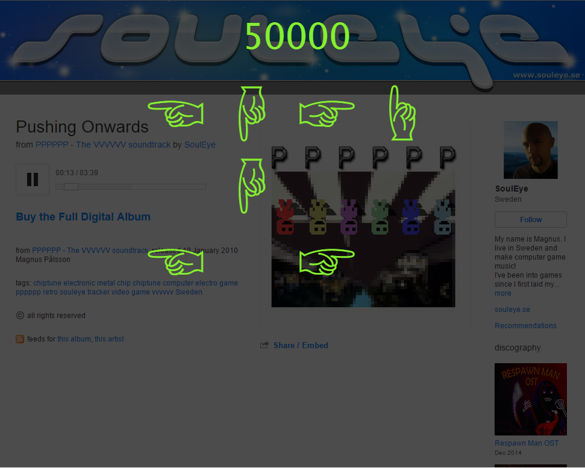

# BandcampRevolution

A bookmarklet that lets you play DDR on Bandcamp

## Play

Go [here](http://jeremyneiman.com/bcr/bcr.html) for instructions and to get the bookmarket.

## How it works

The game pretty much hijacks Bandcamp's page.  Once you click the bookmarklet, it waits for music to start playing.
After the music is played, the game takes control of that audio element.  It makes a second, silent copy that is used
to generate the arrows. The arrows are generated by doing beat detection on the silent copy.  Although The beat 
detection algorithm is really naive and needs work.

###The Bookmarklet

When you click on the bookmarklet, this code is executed:

    (function () { 
  		var jsCode = document.createElement('script'); 
  		jsCode.setAttribute('src', 'http://jeremyneiman.com/bcr/bcr.js');                  
  		document.body.appendChild(jsCode);
  		jsCode.onload = function() {bandCampRevolution();};
  	})();
  	
`bandCampRevolution` is a function that takes two parameters, the first is the speed, 
which defaults to 1400, and the second is a constant that affects how many arrows are generated, which defaults
to 110000.  The "Hard Mode" bookmarklets uses `bandCampRevolution(1000, 80000)`
